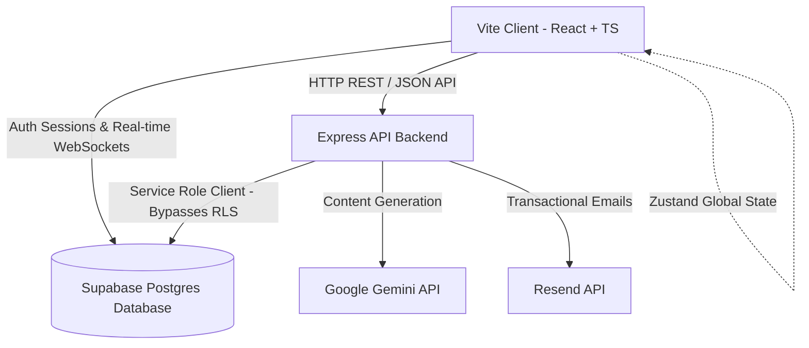
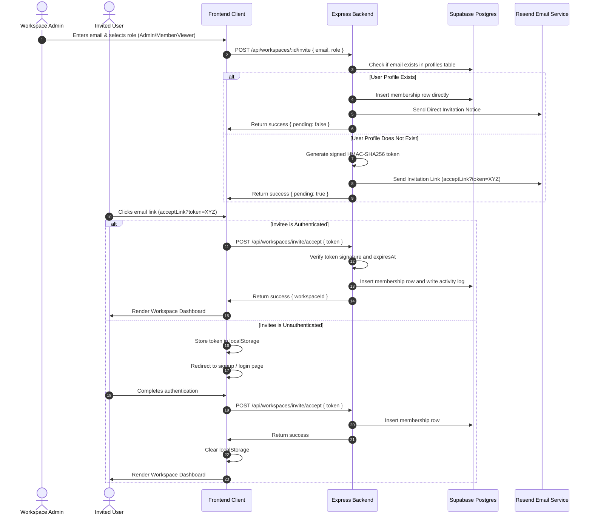
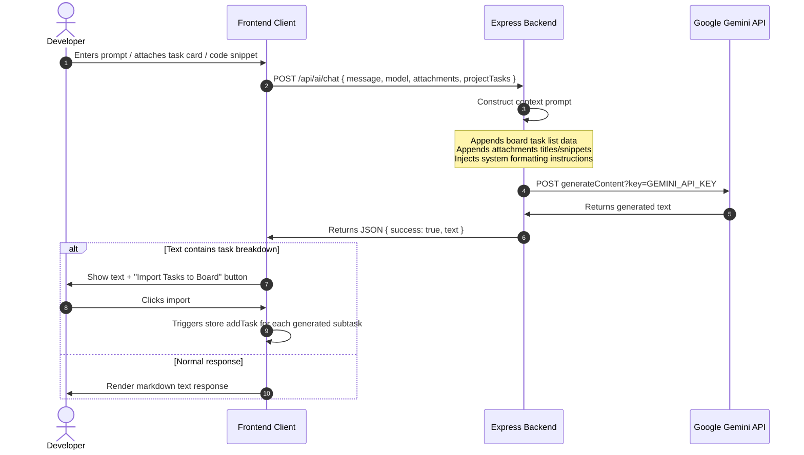

# 🚀 DevCollab — Unified Developer Workspace with Contextual AI Copilot

DevCollab is an industry-grade, real-time project management and collaboration workspace built to consolidate software engineering tasks, documentation wikis, code snippets, and team communication into a single unified canvas. Supported by a secure Express backend and a Postgres database, DevCollab features a context-aware **AI Project Copilot** powered by the Google Gemini API, a stateless email invitation onboarding pipeline, and granular, server-enforced role-based access control.

---

## 📌 The Problem Space & DevCollab's Solution

### The Developer Friction Matrix (The Problem)
Modern software development teams suffer from **tool fragmentation** and **context switching**. 
- **Tool Sprawl:** Teams use Jira/Trello for tasks, Confluence/Notion for docs, GitHub Gists for code snippets, Slack for chats, and email for notifications.
- **Cognitive Context Loss:** Moving between these tools costs developers cognitive energy, leads to stale documentation, and detaches task tracking from the code snippets and wikis.
- **Onboarding Bottlenecks:** Adding new teammates requires manual configuration across 4+ different platforms, leading to delay and human error.
- **Stagnant Workflows:** Project managers lack real-time insights into blocking issues, and developers struggle to automatically decompose product requirements into technical tasks.

### The Unified Developer Canvas (The Solution)
DevCollab consolidates these workflows into a single premium interface:
1. **Unified Context:** Tasks, code snippets, documentation, and activity logs live under the same workspace.
2. **Context-Aware AI Assistant:** The copilot reads active Kanban tasks and attached snippets to review code, summarize progress, or write Daily Standups.
3. **Frictionless Onboarding:** Admins can invite anyone via email. New users receive signed secure links that automatically redeem and join workspaces on signup.
4. **Security-First Administration:** Clear permission barriers block unauthorized deletions, backed by server-side verification using Supabase Service Role configurations.

---

## 🛠️ Comprehensive Feature Deep-Dive

### 1. Context-Aware AI Copilot (Gemini API)
The AI Assistant acts as a virtual tech lead and project manager:
- **Automatic Task Breakdown:** Describe a feature (e.g., *"Implement OAuth2 with Google"*), and the AI returns structured subtasks (`[TASK] title | priority`). The frontend parses this syntax and displays an **"Import Tasks to Board"** button, creating tasks on the Kanban board with appropriate priorities (`p0`, `p1`, `p2`).
- **Contextual Snippet Audits:** Drag and drop snippets into the chat window to request an automated code audit. The AI reviews the code for:
  - Bug risks & parameters sanity.
  - Time/space complexity and optimization.
  - Readability, modern ES6+ paradigms, and clean naming.
  - Security vulnerabilities (SQL injection, unsafe shell executions).
- **Activity Summary & Standups:** Scan the database's recent activity logs to auto-generate daily team standup reports or locate stagnant tasks.
- **Plan Enforcement:** If a workspace is on the `free` plan, the copilot displays a premium paywall overlay redirecting to the payments section.

### 2. Stateless Email Onboarding Pipeline (Resend API)
Onboarding is completely stateless, secure, and fast:
- **Direct Integration for Registered Users:** If the invited email exists, the backend inserts the user into the workspace, creates an activity log, and dispatches a notification email.
- **Stateless HMAC Tokens for New Users:** If the email does not exist, the backend signs a secure token containing `email`, `workspaceId`, `role`, and `expiresAt` using HMAC-SHA256. 
- **Post-Login Interceptor:** The invitation link points to `/invite/accept?token=...`. If the user is unauthenticated, the app caches the token in `localStorage` and redirects to the sign-up form. Upon successful authentication, the redirection interceptor reads the token, calls the backend to redeem the invite, and forwards the user to their new workspace.

### 3. Real-Time Collaborative Kanban Board
- **Drag-and-Drop Columns:** Move cards between *To Do*, *In Progress*, *In Review*, and *Done*.
- **Real-Time Subscriptions:** Leverages Supabase WebSockets to synchronize card positions, descriptions, labels, and priorities instantly across all active users.
- **Access Locks:** Workspace viewers can see the board but are locked out of making edits, which are guarded on the client and database levels.

### 4. Admin Settings Panel & Danger Zone
- **Workspace Administration:** Accessible only to workspace owners and admins. Allows editing the workspace name and description, and managing members.
- **Granular Member Removal:** Admins can remove members from the workspace, immediately revoking access to all associated projects and tasks. Owners cannot be removed.
- **Granular Project Deletion:** Allows deleting individual projects. The backend authorizes this action if the requester is the project owner OR a workspace owner/admin.
- **Owner-Exclusive Danger Zone:** Deleting a workspace is restricted entirely to the workspace `owner`. To prevent accidental deletion, the UI requires typing the workspace name exactly, and the backend validates the requester's role before firing SQL deletions.

### 5. Document Wikis & Code Snippet Repositories
- **Team Wiki**: Write and save rich markdown documentation for APIs, architecture, and onboarding.
- **Snippet Library**: Save reusable code snippets with syntax highlighting. Snippets can be audited by the AI assistant directly from the repository.

---

## 📐 System Architecture & Data Flows

### Platform Architecture



### The Onboarding & Invitation Lifecycle



### AI Copilot Context Pipeline



---

## 🗄️ Database Schema Design

DevCollab utilizes a structured PostgreSQL database hosted on Supabase:

### `profiles` (User Profiles)
- `id` (uuid, primary key) -> links to Supabase `auth.users`
- `email` (text, unique)
- `name` (text)
- `avatar` (text)
- `bio` (text)
- `skills` (text array)
- `github` (text)
- `created_at` (timestamp)

### `workspaces`
- `id` (uuid, primary key)
- `name` (text)
- `description` (text)
- `logo` (text)
- `owner_id` (uuid) -> references `profiles.id`
- `plan` (text: 'free' | 'pro')
- `created_at` (timestamp)

### `workspace_members`
- `id` (uuid, primary key)
- `workspace_id` (uuid) -> references `workspaces.id` ON DELETE CASCADE
- `user_id` (uuid) -> references `profiles.id` ON DELETE CASCADE
- `role` (text: 'owner' | 'admin' | 'member' | 'viewer')
- `joined_at` (timestamp)

### `projects`
- `id` (uuid, primary key)
- `workspace_id` (uuid) -> references `workspaces.id` ON DELETE CASCADE
- `name` (text)
- `description` (text)
- `color` (text)
- `created_at` (timestamp)
- `updated_at` (timestamp)

### `project_members`
- `id` (uuid, primary key)
- `project_id` (uuid) -> references `projects.id` ON DELETE CASCADE
- `user_id` (uuid) -> references `profiles.id` ON DELETE CASCADE
- `role` (text: 'owner' | 'admin' | 'member' | 'viewer')
- `joined_at` (timestamp)

### `tasks`
- `id` (uuid, primary key)
- `project_id` (uuid) -> references `projects.id` ON DELETE CASCADE
- `title` (text)
- `description` (text)
- `status` (text: 'todo' | 'in_progress' | 'in_review' | 'done')
- `priority` (text: 'p0' | 'p1' | 'p2')
- `assignee_id` (uuid) -> references `profiles.id`
- `due_date` (timestamp)
- `task_order` (integer)
- `created_by` (uuid) -> references `profiles.id`
- `created_at` (timestamp)
- `updated_at` (timestamp)

### `activity_logs`
- `id` (uuid, primary key)
- `workspace_id` (uuid) -> references `workspaces.id` ON DELETE CASCADE
- `project_id` (uuid) -> references `projects.id` ON DELETE CASCADE (nullable)
- `type` (text: 'task_created' | 'task_moved' | 'comment_added' | 'member_joined' | etc.)
- `message` (text)
- `user_id` (uuid) -> references `profiles.id`
- `created_at` (timestamp)

---

## ⚙️ Environment Variable Dictionary

### Backend (`backend/.env`)
| Variable | Description |
| :--- | :--- |
| `PORT` | The port Express runs on (local: `3001`). *Leave blank on Render.* |
| `SUPABASE_URL` | The REST endpoint URL of your Supabase project. |
| `SUPABASE_SERVICE_ROLE_KEY` | Admin service role token. **Important:** Never expose this on the frontend. It is used to bypass RLS policies for administrative actions (like deleting workspaces). |
| `CLIENT_URL` | The public URL of the React/Vite frontend client (e.g. `http://localhost:5173`). Used to configure CORS origins. |
| `INVITE_BASE_URL` | The base URL for building onboarding links (e.g. `http://localhost:5173`). Accept accept-tokens will be appended to this. |
| `RESEND_API_KEY` | The API Key from your Resend developer dashboard to send transactional emails. |
| `MAIL_FROM` | The sender identifier for Resend emails (e.g., `DevCollab <onboarding@resend.dev>`). |
| `GEMINI_API_KEY` | Google Generative Language developer key used to query the Gemini models. |

### Frontend (`.env`)
| Variable | Description |
| :--- | :--- |
| `VITE_SUPABASE_URL` | The client-safe Supabase project endpoint. |
| `VITE_SUPABASE_ANON_KEY` | The public Supabase anonymous API key. |
| `VITE_API_URL` | The base URL pointing to the Express backend (local: `http://localhost:3001/api`, prod: `https://your-backend.onrender.com/api`). |

---

## 🚀 Installation & Local Execution

### 1. Database Setup
1. Create a project on [Supabase](https://supabase.com/).
2. Run database scripts to generate the schema (tables: `profiles`, `workspaces`, `workspace_members`, `projects`, `project_members`, `tasks`, `task_comments`, `task_labels`, `activity_logs`, `snippets`, `snippet_tags`, `wiki_pages`, `wiki_page_versions`).
3. Set up Row Level Security (RLS) rules to authorize client reads, while securing administrative deletions.

### 2. Run Backend API
1. Navigate to the backend folder:
   ```bash
   cd backend
   ```
2. Copy `.env.example` to `.env` and fill in the values:
   ```bash
   cp .env.example .env
   ```
3. Install packages and run in development mode:
   ```bash
   npm install
   npm run dev
   ```
   *The server will start on port `3001`.*

### 3. Run Frontend Client
1. Return to the root folder:
   ```bash
   cd ..
   ```
2. Copy `.env.example` to `.env` and fill in the values:
   ```bash
   cp .env.example .env
   ```
3. Install packages and run in development mode:
   ```bash
   npm install
   npm run dev
   ```
   *Vite will launch on [http://localhost:5173](http://localhost:5173).*
